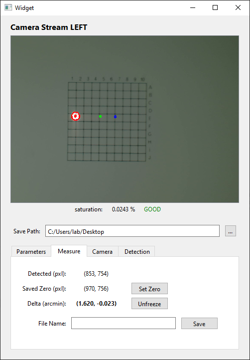

# Example Project

Library for a blob detection GUI I created for various applications within my field. This GUI allows the user to 
find a "blob" using their preferred camera (webcam by default). The "blobs" can then be mark and the deviation from 
one detection to another can be recorded to a CSV.

## Getting Started

Using the command terminal type:
```pip install <path to tar file>\blob_detection.tar.gz```
...or navigate to the project's setup file and type:
```python setup.py install```

## Included Batch

Run the included batch script, "create_shortcut_local.bat" to create a Desktop shortcut that will call the main GUI.

## Using the GUI

Running the ui-widget.py script will open the main blob detection interface. This GUI uses the defined values in the
config file (support\gui_settings.json). This is where you can set certain defaults as well as the camera ID for 
loading the camera hardware (this will work with a webcam if present). This config was meant to not be changed for 
often if at all, whereas typical settings that made be useful to change can be altered by the user on thr frontend.
In reference to the preview image in the following section, the latest image frame will be displayed under "Camera 
Stream". Below this live stream is the saturation feedback which will tell the user whether the current camera 
settings and lighting conditions are resulting in a low, good, or high saturation. Below here are the four tabs that 
control various settings. The first tab, "Parameters", allows for inputs that describe useful information about the 
measurement itself. These values are not used for detection, but are saved to the output CSV. The next tab, "Measure", 
reports the detected blob center, the saved zero point, the difference between a measured point and "zero", and the 
name of the file to save the data to. The next tab, "Camera", is used for controlling and connecting to the local 
camera. An image can be captured here as well and saved for later using the file name in the local text box. The final 
tab, "Detection", can be used to control various settings related to how the blobs are detected. This includes, blob 
size, the threshold value (used for edge detection), circularity (if circle fits are implemented), and useful overlays. 
If these values are altered and the user would like to make these the default moving forward, the "Save to Config" 
button can be used to implement this change to the configuration file (support\gui_settings.json).

## UI Preview

*red represents the live detected blob, green represents the saved zero, and blue represents the measured point*


